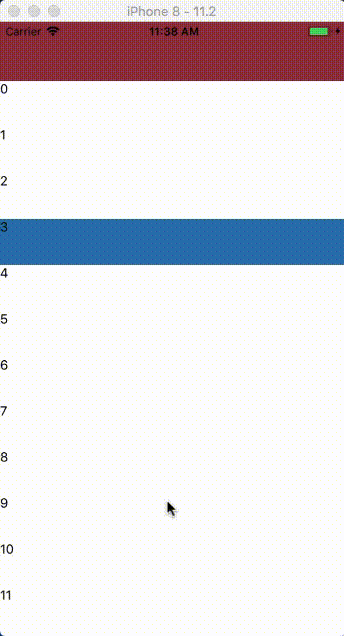
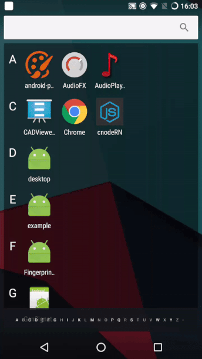

# react-native-stickyheader
[](https://www.npmjs.com/package/react-native-stickyheader)

# 介绍

此组件实现类似React Native ScrollView组件的吸顶效果。
使用原生驱动动画，支持FlatList,SectionList,ListView等有`onScroll`方法的组件。

## 效果

| iOS | Android |
| --- | ------- |
|  |  |

# Example

```js
import StickyRendererComponent from './src/StickyRendererComponent'

export default class App extends Component {

  _renderItem(info) {
    if (info.index == 3) {
      return <View
        style={{ height: 50, backgroundColor: '#2578b5' }}>
        <Text>{info.item}</Text>
      </View>
    }
    return (
      <View
        style={{ height: 50, backgroundColor: '#ffffff' }}>
        <Text>{info.item}</Text>
      </View>
    )
  }
  componentDidMount() {
    StickyRendererComponent.cellStickyRendererRef = this._flatList
    StickyRendererComponent.cellStickyRendererKey = 3
  }
  render() {
    let data = []
    for (let index = 0; index < 100; index++) {
      data.push(index)
    }
    return (
      <View style={styles.container}>
        <View style={{ height: 64, backgroundColor: '#973444' }}></View>
        <FlatList
          ref={flatList => this._flatList = flatList}
          CellRendererComponent={StickyRendererComponent}
          collapsable={false}
          scrollEventThrottle={1}
          data={data}
          keyExtractor={(item, index) => item}
          renderItem={this._renderItem.bind(this)}
        />
      </View>
    );
  }
}

const styles = StyleSheet.create({
  container: {
    flex: 1,
    backgroundColor: '#ffffff',
    justifyContent: 'center',
  },
});
```
**Note:** `scrollEventThrottle={1}`此属性必须设置且为1,因为要保证有足够的偏移量回调。关于`cellStickyRendererKey`值的设定，获得你想要悬浮的cell的key值，赋值给此属性。请注意`SectionList`的key值是sections里的`key:你返回的key`。比如说`sections`为`[key:'123',data:['1','2']]`,`keyExtractor`属性，你返回的key为`index`，那么他的cellKey就为`'123':'1'`,`'123':'2'`...


# react-native-stickyheader 的原理

待整理


## Installation

```
$ npm install react-native-stickyheader --save
```


## Usage (API)

此组件有以下属性：

| Property | Type | Required | Description |
| -------- | ---- | -------- | ----------- |
| `cellStickyRendererRef` | `object` | Yes | FlatList等组件的ref  |
| `cellStickyRendererKey` | `string or int` | Yes | 悬浮cell的key值 |

## 更新
### 1.1.0

- 支持安卓 

### 1.0.3

- bug修改

### 1.0.0

- 吸顶效果

## Contributing

此组件受到ScrollView组件启发而成。如果觉得好用,请点一个star,有bug的话请提issue，我会尽快解决。

